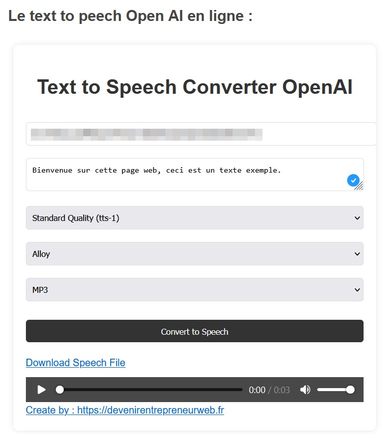

# Text-To-Speech-Openai-Web-Interface
Text To Speech Openai Web Interface

Generer une voix off a partir de texte avec l'api OpenAI.

Il suffit de rentrer votre clé API et le texte.

Vous pouvez le tester directement ici : https://devenirentrepreneurweb.fr/blog/text-to-peech-openai.html

Mes liens :

Chaine youtube : https://www.youtube.com/channel/UCNFED93Cb1U6-QnrVXZlBkw

Formation : https://devenirentrepreneurweb.fr/formations/

Blog : https://devenirentrepreneurweb.fr
